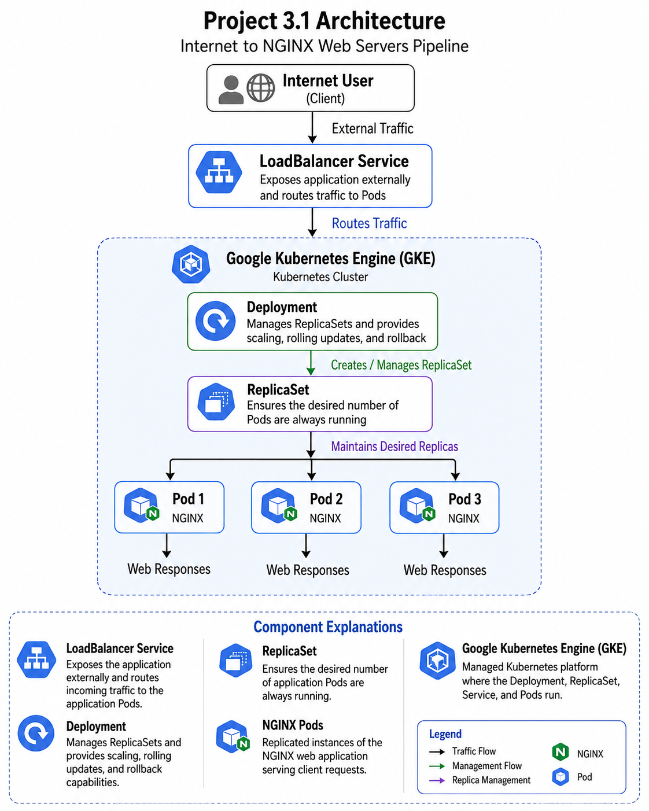

# Kubernetes Project 3.1 — Deploying Scalable Applications using ReplicaSets and Deployments

# Project Overview

This project demonstrates:

- ReplicaSets
- Deployments
- Scaling applications
- Rolling updates
- Rollbacks
- Services

Platform Used:

- Google Kubernetes Engine (GKE)
- Docker Hub as image registry

---

# Architecture



```
                              Internet User
                                    │
                                    ▼
                        +------------------------+
                        |   LoadBalancer Service |
                        +------------------------+
                                    │
                                    ▼
                        +------------------------+
                        |      Deployment        |
                        |  (Manages Updates)     |
                        +------------------------+
                                    │
                                    ▼
                        +------------------------+
                        |      ReplicaSet        |
                        | Maintains Pod Count    |
                        +------------------------+
                           │         │         │
                           ▼         ▼         ▼
                     +---------+ +---------+ +---------+
                     |  Pod 1  | |  Pod 2  | |  Pod 3  |
                     | NGINX   | | NGINX   | | NGINX   |
                     +---------+ +---------+ +---------+
```

# workflow
```
Prepare Application
        │
        ▼
Create Docker Image
        │
        ▼
Push Image to Docker Hub
        │
        ▼
Create ReplicaSet
        │
        ▼
ReplicaSet Creates Pods
        │
        ▼
Verify Self-Healing
(Delete a Pod → ReplicaSet Recreates It)
        │
        ▼
Create Deployment
        │
        ▼
Expose Application using Service
        │
        ▼
Scale Deployment
        │
        ▼
Perform Rolling Update
        │
        ▼
Rollback Deployment (if required)
```

# Project Structure

```text
k8s-nginx-project/
│
├── index.html
├── Dockerfile
├── replicaset.yaml
├── deployment.yaml
├── service.yaml
```

---

# Step 1 — Create Project Directory

```bash
mkdir k8s-nginx-project
cd k8s-nginx-project
```

---

# Step 2 — Create index.html

Create file:

```bash
nano index.html
```

Add:

```html
<!DOCTYPE html>
<html>
<head>
    <title>Kubernetes Project</title>
</head>
<body style="text-align:center; margin-top:100px; font-family:Arial">

<h1>Welcome to Kubernetes ReplicaSet Project</h1>

<h2>Version 1</h2>

<p>This application is running inside Kubernetes.</p>

</body>
</html>
```

---

# Step 3 — Create Dockerfile

Create file:

```bash
nano Dockerfile
```

Add:

```dockerfile
FROM nginx:alpine

COPY index.html /usr/share/nginx/html/index.html

EXPOSE 80
```

---

# Step 4 — Build Docker Image

Replace:

```text
YOUR_DOCKERHUB_USERNAME
```

with your Docker Hub username.

Build image:

```bash
docker build -t YOUR_DOCKERHUB_USERNAME/nginx-app:v1 .
```

Example:

```bash
docker build -t raviteja/nginx-app:v1 .
```

---

# Step 5 — Login to Docker Hub

```bash
docker login
```

Enter:

- Docker Hub username
- Docker Hub password or token

---

# Step 6 — Push Image to Docker Hub

```bash
docker push YOUR_DOCKERHUB_USERNAME/nginx-app:v1
```

---

# Step 7 — Verify GKE Cluster

Check cluster:

```bash
kubectl get nodes
```

Expected output:

```text
NAME                                      STATUS   ROLES    AGE
gke-cluster-default-pool-xxxx             Ready    <none>   10m
```

---

# Step 8 — Create ReplicaSet YAML

Create file:

```bash
nano replicaset.yaml
```

Add:

```yaml
apiVersion: apps/v1
kind: ReplicaSet

metadata:
  name: nginx-rs

spec:
  replicas: 3

  selector:
    matchLabels:
      app: nginx-app

  template:
    metadata:
      labels:
        app: nginx-app

    spec:
      containers:
      - name: nginx-container
        image: YOUR_DOCKERHUB_USERNAME/nginx-app:v1

        ports:
        - containerPort: 80
```

---

# Step 9 — Apply ReplicaSet

```bash
kubectl apply -f replicaset.yaml
```

---

# Step 10 — Verify ReplicaSet

```bash
kubectl get rs
```

Check pods:

```bash
kubectl get pods
```

---

# Step 11 — Test ReplicaSet Self-Healing

Delete one pod:

```bash
kubectl delete pod POD_NAME
```

Watch pod recreation:

```bash
kubectl get pods -w
```

Kubernetes automatically creates a new pod.

---

# Step 12 — Create Deployment YAML

Create file:

```bash
nano deployment.yaml
```

Add:

```yaml
apiVersion: apps/v1
kind: Deployment

metadata:
  name: nginx-deployment

spec:
  replicas: 3

  selector:
    matchLabels:
      app: nginx-app

  template:
    metadata:
      labels:
        app: nginx-app

    spec:
      containers:
      - name: nginx-container
        image: YOUR_DOCKERHUB_USERNAME/nginx-app:v1

        ports:
        - containerPort: 80
```

---

# Step 13 — Apply Deployment

```bash
kubectl apply -f deployment.yaml
```

---

# Step 14 — Verify Deployment

```bash
kubectl get deployments
```

Check pods:

```bash
kubectl get pods
```

---

# Step 15 — Create Kubernetes Service

Create file:

```bash
nano service.yaml
```

Add:

```yaml
apiVersion: v1
kind: Service

metadata:
  name: nginx-service

spec:
  type: LoadBalancer

  selector:
    app: nginx-app

  ports:
  - port: 80
    targetPort: 80
```

---

# Step 16 — Apply Service

```bash
kubectl apply -f service.yaml
```

---

# Step 17 — Get External IP

```bash
kubectl get svc
```

Wait until EXTERNAL-IP appears.

Access application:

```text
http://EXTERNAL-IP
```

---

# Step 18 — Scale Application

Scale to 5 replicas:

```bash
kubectl scale deployment nginx-deployment --replicas=5
```

Verify:

```bash
kubectl get pods
```

---

# Step 19 — Perform Rolling Update

Modify:

```html
<h2>Version 1</h2>
```

to:

```html
<h2>Version 2</h2>
```

---

# Step 20 — Build New Docker Image

```bash
docker build -t YOUR_DOCKERHUB_USERNAME/nginx-app:v2 .
```

---

# Step 21 — Push New Image

```bash
docker push YOUR_DOCKERHUB_USERNAME/nginx-app:v2
```

---

# Step 22 — Update Deployment Image

```bash
kubectl set image deployment/nginx-deployment nginx-container=YOUR_DOCKERHUB_USERNAME/nginx-app:v2
```

---

# Step 23 — Verify Rolling Update

Check rollout status:

```bash
kubectl rollout status deployment/nginx-deployment
```

Watch pods:

```bash
kubectl get pods -w
```

Open browser again and verify Version 2.

---

# Step 24 — Rollback Deployment

Rollback to previous version:

```bash
kubectl rollout undo deployment/nginx-deployment
```

Verify rollout history:

```bash
kubectl rollout history deployment/nginx-deployment
```

Refresh browser and verify Version 1 returns.

---


---

# Step 28 — Monitor Pods

View pods:

```bash
kubectl get pods
```

View logs:

```bash
kubectl logs POD_NAME
```

Describe pod:

```bash
kubectl describe pod POD_NAME
```

---

# Important Commands Summary

## Pods

```bash
kubectl get pods
```

## ReplicaSets

```bash
kubectl get rs
```

## Deployments

```bash
kubectl get deployments
```

## Services

```bash
kubectl get svc
```

## Logs

```bash
kubectl logs POD_NAME
```

## Delete Everything

```bash
kubectl delete all --all
```

---

# Expected Outcome

At the end of this project you will understand:

- ReplicaSets
- Deployments
- Kubernetes Services
- Scaling Applications
- Rolling Updates
- Rollbacks
- GKE Deployments
- Docker Hub Registry Integration

